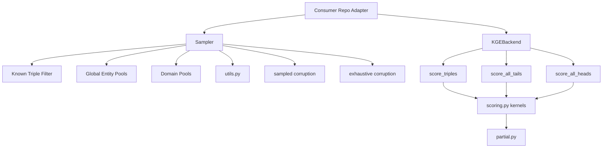

# torch-kge-kernels

Shared PyTorch kernels for KGE corruption generation, negative sampling, and
low-level scoring.

`torch-kge-kernels` owns tensor kernels only. Downstream repos are expected to
adapt their own models to the explicit `KGEBackend` contract:

- `score_triples(h, r, t) -> [N]`
- `score_all_tails(h, r) -> [B, E]`
- `score_all_heads(r, t) -> [B, E]`

Normalization policy, model-method dispatch, training-policy choices, and
non-batched fallbacks belong in consumer-side adapters, not in this repo.

## Public API

The package is intentionally small:

- `corrupt(...)`: one public corruption entry point for sampled or exhaustive
  negative generation in `(r, h, t)` format
- `score(...)`: one public scoring entry point for direct triple scoring,
  exhaustive head/tail scoring, or sampled head/tail scoring

Specialized kernels still exist internally, but the public surface is centered
on those two delegation points.

## Structure

```text
torch-kge-kernels/
├── README.md
├── pyproject.toml
├── src/
│   └── kge_kernels/
│       ├── __init__.py
│       ├── sampler.py
│       │   └── vectorized corruption generation in (r, h, t)
│       └── scoring.py
│           └── low-level scoring kernels over an explicit KGEBackend
│       ├── partial.py
│       │   └── partial-atom score precompute and lookup tables
│       ├── types.py
│       │   └── sampler/scoring dataclasses and protocols
│       └── utils.py
│           └── internal tensor helpers such as triple hashing
└── tests/
    ├── test_sampler.py
    ├── test_partial.py
    └── test_scoring.py
```

## Module Diagram



## Responsibilities

- `sampler.py`: compiled-friendly negative/corruption generation with filtering, uniqueness, and optional typed/domain-aware pools.
- `scoring.py`: one public `score(...)` entry point over private specialized kernels; this repo does not inspect model objects.
- `partial.py`: partial-atom score precompute and lookup for grounder-style use cases.
- `types.py`: explicit backend/config contracts used by the sampler and scoring kernels.
- `utils.py`: internal tensor helpers shared by the core kernels.
- consumer adapters: DpRL, torch-ns, or grounder wrappers that decide normalization policy, model dispatch, fallback behavior, and any training-specific sampling policy.
